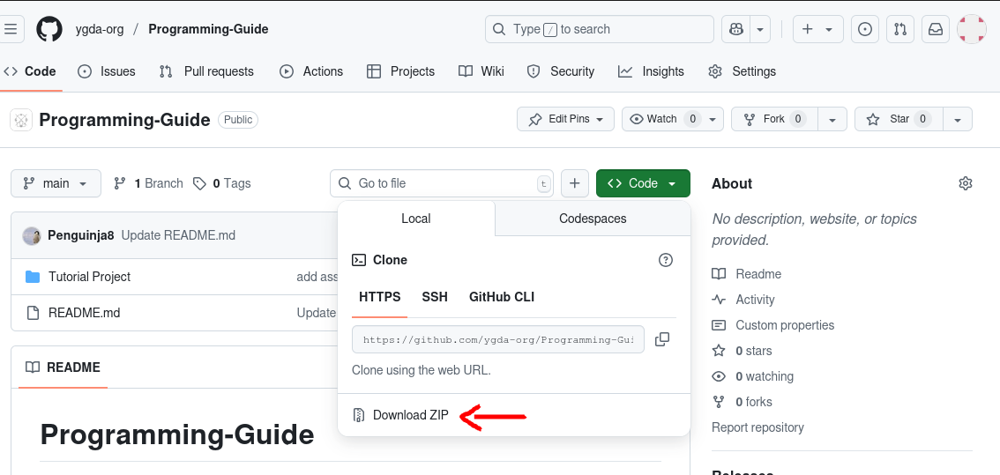
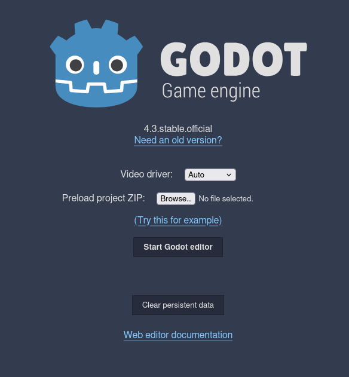

# YGDA Programming Guide

Welcome to the YGDA programming guide! This guide will give you a basic introduction to the Godot game engine. By the end, you should have the basic knowledge to start making your own games. No previous Godot or game dev experience is needed! You shold have some experience in a programming language like python or java though. 

This guide will walk you through on creating a **simple 2D platformer** with pre-created pixel art assets. 

The tutorial will be split into chapters to be easily digestible. We encourage you to experiment by yourself after you finish this tutorial. Don't get stuck in tutorial hell!

> Throughout the tutorial, if you see anything you think is missing or can be improved upon, feel free to make a PR or issue addressing your concerns!
---

## Working in Godot

Before you even start setting up your project, there are some things you should keep in mind throughout this guide:

- Save your project periodically (`Control + S`)
- Stay organized and keep track of your files and assets
- If anything is unclear, you can ask an officer for help or use the [Godot Docs](https://docs.godotengine.org/en/4.4/). We recommend trying to figure it out on your own first, but we're happy to help.

> You can join the discord for help and advice!

---

## Setup

### 1. Download Godot

In this project, as well as in TJ-RPG, we will be using **4.4-stable**, which you can download [here](https://godotengine.org/download/archive/4.4-stable/) for Windows, macOS, or Linux.  

> Alternatively, you can use the [Godot Web Editor](https://editor.godotengine.org/releases/4.3.stable/godot.editor.html). Use this as a last resort if you cannot download the engine on your device, as there are some functions that will be inaccessible. The web editor is also on version 4.3, which should work for this tutorial. We really recommend you use the local editor though.*

### 2. Download the assets

This repo contains the assets you will be using in the game.  
*Alternatively, make your own! This will be really time-consuming, wouldn't recommend if it's your first time using Godot.*

- If you have Godot on your computer, navigate to the [programming guide repo](https://github.com/ygda-org/Programming-Guide) (which you probably are already on), download the zip file, and extract the contents.

- If you are using the web editor, download [this](https://drive.google.com/file/d/1TVeHjCGbOdk_NbcGMKpGJMo8EU4YazeH/view?usp=sharing).

> You can also follow the instructions offline if you'd like by reading the tutorial from the repo you just downloaded if you have godot on your computer

### 3. Setup your Godot project

- If you have Godot on your computer:
  - Create a new Godot project by pressing the 'Create' button in the top left corner. This will make a new project folder on your computer. Drag in the `assets` folder from the zip file you previously extracted into that project folder.

- If you are using the web editor:
  - Simply select the zip file you downloaded earlier and start the editor.\
  

Now continue with these steps:

- At the top center, change the scene from '3D' to '2D' mode.
- Go to `Project` in the toolbar and click on `Project Settings`, then change the following settings in the General section (use the search bar):  

    - `Rendering -> 2D -> Snap 2D Transformations to Pixel`: **On**
    - `Rendering -> 2D -> Snap 2D Vertices to Pixel`: **On**
    - `Rendering -> Textures -> Default Texture Filter`: **Nearest**

    *This is because we will be using pixel art in our game, and we need the images to be pixel-perfect.*

    - `Display -> Window -> Viewport Width`: **960**
    - `Display -> Window -> Viewport Height`: **540**

    *These can be changed based on preference, but should be alright for our purposes.*

    - `Display -> Window -> Mode`: **canvas_items**
> You might need to enable Advanced Settings to see some of these options.
---

You are now ready to begin the actual tutorial!  
You can move on to section one about [Character Movement](./sections/section-1.md).

