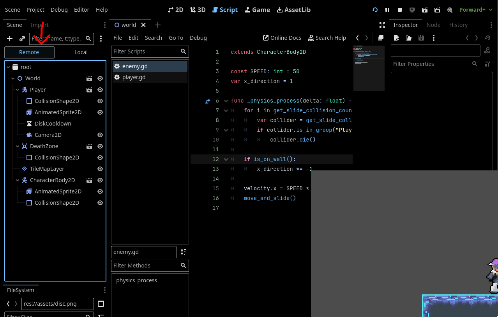

# Scene Management & SceneTree Intro
In the intro to this extension, we will explain shortly how the Godot `SceneTree` works and how to write global logic, i.e logic that can be accessed anywhere (like to switch a level).

---

## The Scene Tree
Fundamentally, how Godot works is by holding a instantiated a `SceneTree` object that holds all the nodes and scenes in your game. This `SceneTree` holds the logic for running the main loop of your game.


We can examine our current scene tree by examining the `SceneTree` as our game runs. Run your game, navigate to the Scene Dock, and switch to the `Remote` tab. You can then expand all the drop downs and examine the state of every single node that is currently on the scene tree. 

 

> This is often useful for debugging! You can also click on each node in a scene and examine as well as change any variables, even if they aren't prepended with the `@export` annotation. For example, if you click on the player, you can set any of the internal variables we made earlier like `x_direction` or `is_dead`. You can't change variables with the `const` qualifier, however.

Here, we can make a few observations:
1. The root node of the `SceneTree` is of type `Window`. You can access this from any script with `get_tree().root`. It should make sense that the root node is of type window as everything in your scene is drawn in a window.
2. Our `World` node - containing our player, enemies, stage, etc - is a child of this window.


If we wanted to change this stage to different levels, we would logically have to replace the `World` node to a different scene. We do something similar with our logic to restart the game in our `player.gd` script:

```gdscript
func die() -> void:
	is_dead = true
	set_deferred("velocity", Vector2.ZERO)
	$AnimatedSprite2D.flip_v = true
	$AnimatedSprite2D.play("jump")
	$CollisionShape2D.set_deferred("disabled", true)
	
	Engine.time_scale = 0.5
	await get_tree().create_timer(DELAY_TILL_RESTART).timeout
	Engine.time_scale = 1
	get_tree().change_scene_to_file("res://scenes/world.tscn")
```

But, where would we put the logic to switch to different scenes? Since the `World` scene is going to be switched out, we can't house it in there. We could have the current scene be a child of a scene manager node and switch the scene manager's child to the next scene, but Godot gives us another tool to tackle this problem.

## Autoloads (also called Singletons or Globals)
**Autoloads** in Godot allow us to achieve the function of static classes.

If you aren't familiar with static classes, they:
- Are instantiated at the start automatically and exists till the end of the program
- They aren't tied to any specific instance
    - Ex: A enemy object is connected to a specific enemy
- Can hold global variables
- Can hold static functions

Autoloads function basically the same. They allow us to store persistent information throughout scene switches and logic that is able to be called from anywhere. Thus, it's the perfect tool to use for our level switcher.

An example of an Autoload you should remember is the `Input` class that allows us to capture input. Recall how it's accessible from anywhere. This is the snippet in our player movement script:
```gdscript
func _physics_process(delta: float) -> void:
    ...
	
	if Input.is_action_pressed("Left"):
		x_direction = -1
		$AnimatedSprite2D.flip_h = true
	elif Input.is_action_pressed("Right"):
		x_direction = 1
		$AnimatedSprite2D.flip_h = false
	else:
		x_direction = 0
```

> The Godot docs describe Autoloads in greater detail [here](https://docs.godotengine.org/en/stable/tutorials/scripting/singletons_autoload.html).

You can add new Autoloads in the toolbar under `Project > Project Settings...`. These Autoloads are still in the `SceneTree`.

---

Now, you have some context of the tools we will use to add levels to our game. In the [next section](./section-1.md), we will start the actual implementation.
