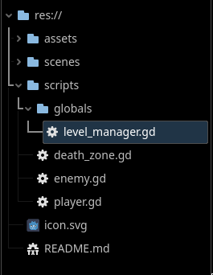
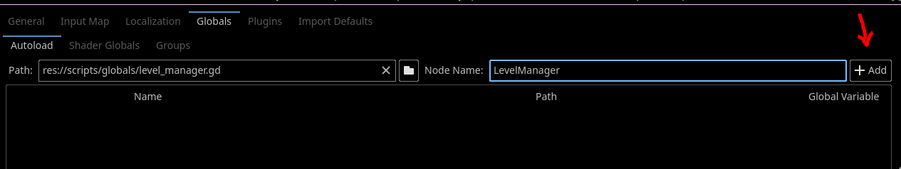
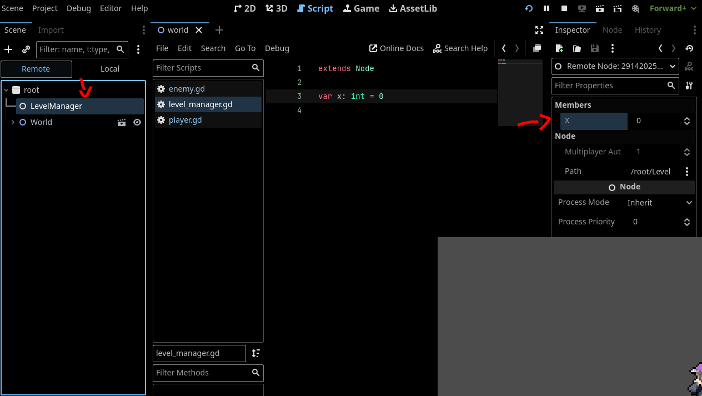
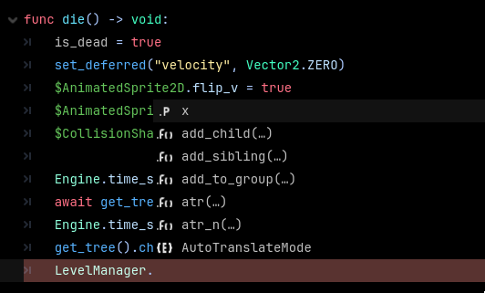

# Creating a Level Manager
Now that you know what an Autoload is, we can create one! In this section, we will be creating the `LevelManager` that will do the work of switching the levels in our game.

## Creating an Autoload
1. Create a new script called `level_manager.gd` and put it in the appropriate place in your filesystem.



> It's best to make a separate folder for global scripts for organization.

2. Add some filler variable under `extends Node` that we will use for experimentation.

```gdscript
extends Node

var x: int = 0

```
> Our global script has to extend `Node` because Autoloads are still in the `SceneTree`. Anything that is on the `SceneTree` must be `Node`. If you aren't familiar with Object-Oriented Programming, if you extend the class `Node`, that also means that the new class is also a `Node`.

3. Now, go to `Project > Project Settings...`. Then navigate to the `Globals` tab and add your newly created script as a Autoload. Set the name as `LevelManager`.
 

## Where is an Autoload on the SceneTree?

Lets try now running the project and seeing where our `LevelManager` resides in the `SceneTree`. Go ahead and run the project and, in the Scene Dock, navigate to the remote tab. Here you can inspect our newly created `LevelManager`

 

You will notice that the Autoload is just like any another `Node` in the `SceneTree`. But if you try typing it's class name in any script, you will notice that you can access it and any of it's attributes from anywhere.
 

> TODO: complete
