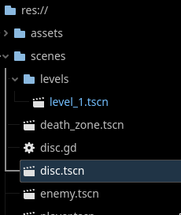
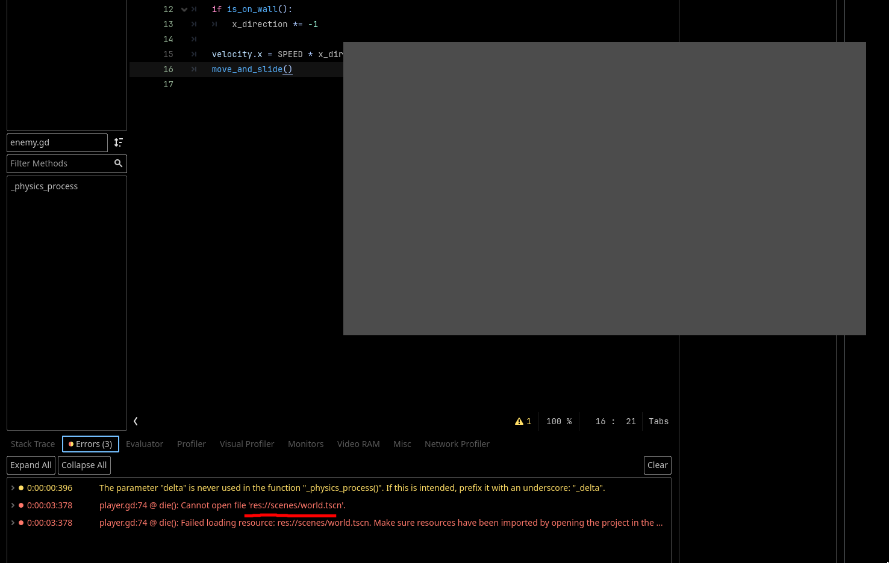

# Creating a Level Manager
Now that you know what an Autoload is, we can create one! In this section, we will be creating the `LevelManager` that will do the work of switching the levels in our game.

---

## Creating an Autoload
1. Create a new script called `level_manager.gd` and put it in the appropriate place in your filesystem.


> It's best to make a separate folder for global scripts for organization.

2. Add some filler variable under `extends Node` that we will use for experimentation.

```gdscript
extends Node

var x: int = 0

```
> Our global script has to extend `Node` because Autoloads are still in the `SceneTree`. Anything that is on the `SceneTree` must be `Node`. If you aren't familiar with Object-Oriented Programming, if you extend the class `Node`, that also means that the new class is also a `Node`.

3. Now, go to `Project > Project Settings...`. Then navigate to the `Globals` tab and add your newly created script as a Autoload. Set the name as `LevelManager`.
 

## Where is an Autoload on the SceneTree?

Lets try now running the project and seeing where our `LevelManager` resides in the `SceneTree`. Go ahead and run the project and, in the Scene Dock, navigate to the remote tab. Here you can inspect our newly created `LevelManager`

 

You will notice that the Autoload is just like any another `Node` in the `SceneTree`. Also, if you try typing it's class name in any script, you will also see that you can access it and any of it's attributes from anywhere.

 

## Reorganizing our Filesystem

Since we are refactoring our game into levels, it would be wise to refactor our folders to reflect that as well. Lets rename `world.tscn` to `level-1.tscn` and create a seperate folder for our levels.

 

> For each project, you should have a consistent naming convention that you abide by. For this guide, we decided to only use lowercase alphanumeric letters with underscores for spaces.

Since our old logic in our player movement script for death resets the scene to the path at `res://scenes/world.tscn`, it will, sadly, be broken now. This is something you should keep in mind when making scripts that depend on scenes in specific locations.

 

> You can double click on the error on the console to navigate to the exact line that caused it!

## Bug squashing

Lets fix the bug we just created by migrating the logic to restart the level from `player.gd` to our new `LevelManager`. It would be wise to design the script to be able to handle multiple levels and track the current one the player is on. There is a couple different ways you can approach this. Your script will basically have to:

- Reference all the levels either by path or loading them with `preload(path)`
    - You might have to use `get_tree().change_scene_to_packed(scene)` or `get_tree().change_scene_to_file(path)` depending on which one you choose
- Store the level in some type of data structure which will make it easy to move up a level
- Track the current level
- Define a function that will allow any script to reset the current level
- Not in the script, but you need to update your player `die()` function to call your new reset level logic in your `LevelManager` instead
    - You can call any functions defined in the `LevelManager` with `LevelManager.whatever_function(whatever_parameters)`

Try doing this one yourself! There are several equally correct ways to achieve this. 

Here is how we did it:
```gdscript
extends Node

const levels: Array[PackedScene] = [preload("res://scenes/levels/level_1.tscn")]
var current_level: int = 0

func restart_level():
	get_tree().change_scene_to_packed(levels[current_level])
```

Our script addresses the previous requirements by:
- Loading the levels in an array of `PackedScene`s
- Indexing the array with the `current_level` variable
- Defining a function `restart_level` that changes the scene to `levels[current_level]`

---

Cool! You've created an Autoload that will make it easier to add more levels to the game. In the [next section](./section-2.md), we are going to actually make said levels and logic for the transition.
