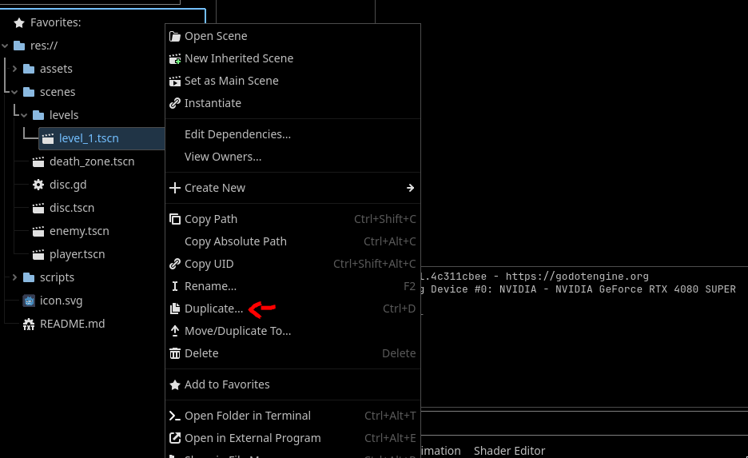
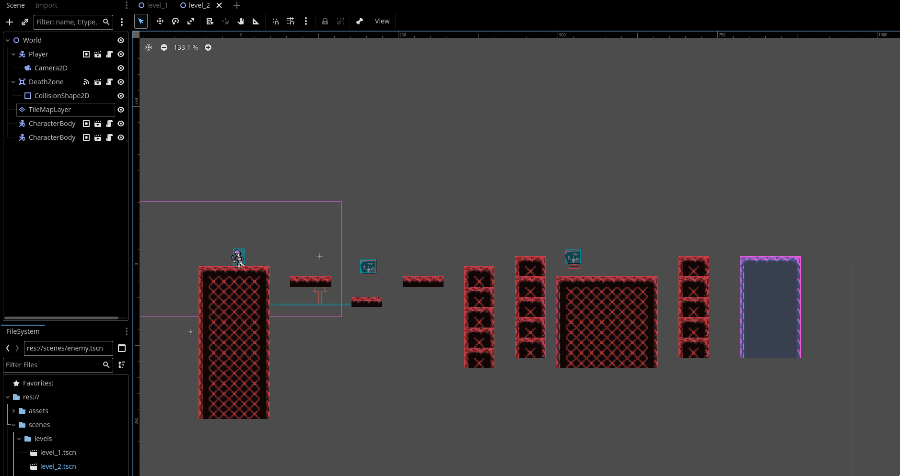
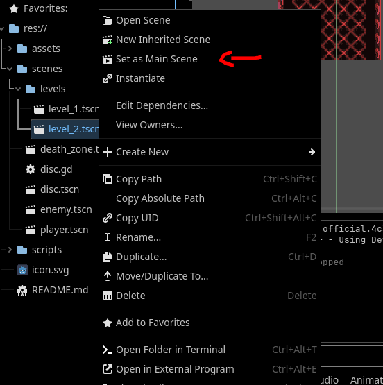
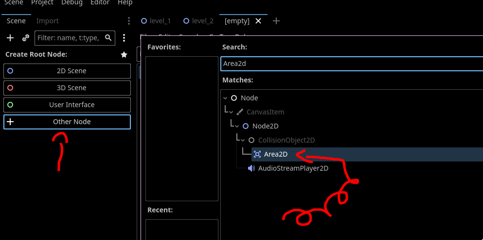
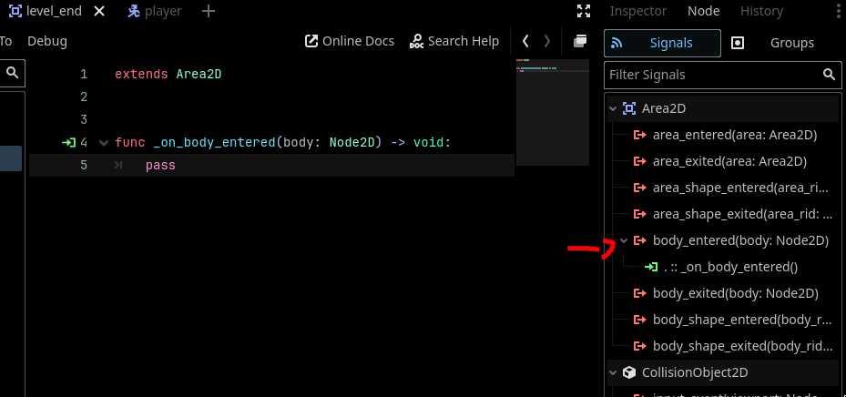
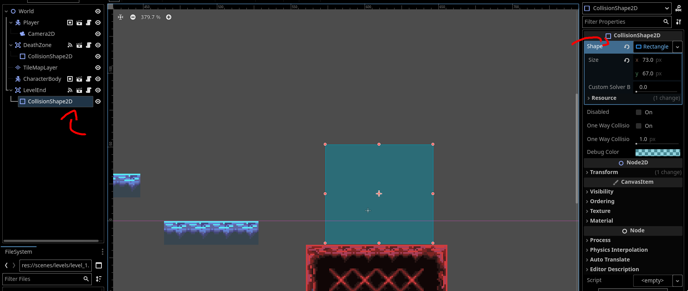

# New Levels and Transitions
We have a basic `LevelManager`, but there is only one level for it to manage! In this section, we will add new levels for our platformer.

---

## Creating a New Level

Let's duplicate the `level_1.tscn` so we don't have to create a new scene from scratch. The name of this scene should be obvious (`level_2.tscn`). 

 

Bring out your inner game designer and create a new level! Move around obstacles, enemies, the player, etc. You can leave it the same if you're boring. Make sure both your levels have a clear start and end for later when we add the transitions.



If you would like to test your level, you can temporarily set it as the `Main Scene`, then change it back when you are finished.

 

## Going to the Next Level

We need our `LevelManager` to also be able to navigate to the next level. 

1) Add your newly created level in whatever data structure you use to hold them. 
```gdscript
const levels: Array[PackedScene] = [preload("res://scenes/levels/level_1.tscn"), preload("res://scenes/levels/level_2.tscn")]
```

2) Define a new function that swaps the stage to the next level. Your function should:
- Increment the current level
    - Make sure to check that this next level actually exists! You can return and print an error message if it doesn't.
- Switch the level to the next one

Here's how ours looks like:
```gdscript
extends Node

const levels: Array[PackedScene] = [preload("res://scenes/levels/level_1.tscn"), preload("res://scenes/levels/level_2.tscn")]
var current_level: int = 0

func restart_level():
	get_tree().change_scene_to_packed(levels[current_level])

func next_level():
	if len(levels) == current_level + 1:
		print("Already at the last level!")
		return
	
	current_level += 1
	restart_level()
```


## Adding a Transition Between the Levels

Now, we need a way to detect when the player finishes the level. We can do this with an `Area2D` to detect when the player enters the end of the level. You should remember using this with the `DeathZone` we made earlier. If you are comfortable with Godot now, you can try doing this section yourself! The new `Area2D` basically needs to call a function in your `LevelManager` that starts the next level when the player enters it.

1) Create a new scene with base `Area2D`. You can call this `LevelEnd`.

 

2) Attach a new script to this `Area2D`. Save this new scene and script to their appropriate folders.

 

3) Attach the `_on_body_entered(body: Node2D)` signal of the `Area2D` to your script. 

 

Now, update this script to check if the `body` is in the `"Player"` group. You probably know what to do if it is.
- Remember that you can check if the body is in a group with `body.is_in_group(group: String)`

Here's what our script looks like:
```gdscript
extends Area2D

func _on_body_entered(body: Node2D) -> void:
	if body.is_in_group("Player"):
		LevelManager.next_level()

```

## Putting it all together

Lets now put our `LevelEnd` at the end of our first level. Put it where ever is appropriate in your custom made map.

 

Try testing your game out now! When you walk up to where ever you put the `LevelEnd`, it should send you to the next level. Go ahead and make as many levels as you would like. We made one extra for a total of 3.

> If it doesn't work, that just means you have a chance to practice your debugging :)

---

We have a functioning `LevelManager` now! In the [next section](./section-3.md), we will add a main menu to put it all together.
