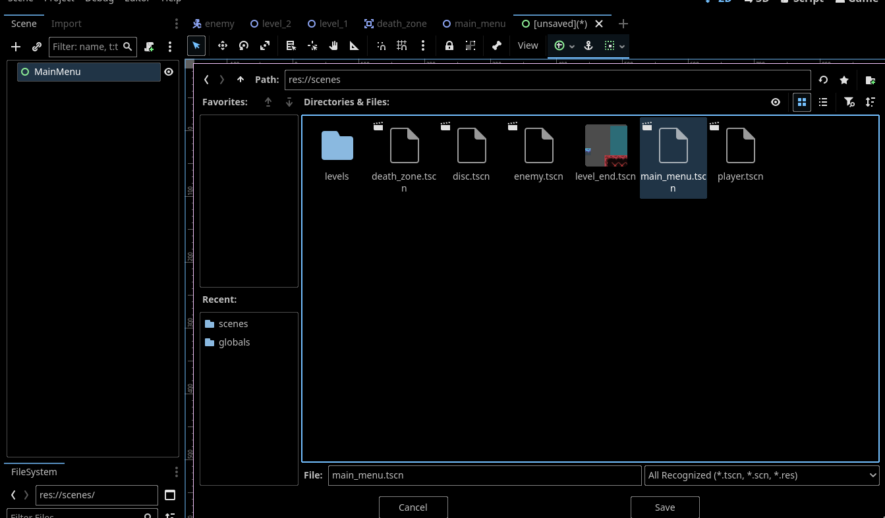
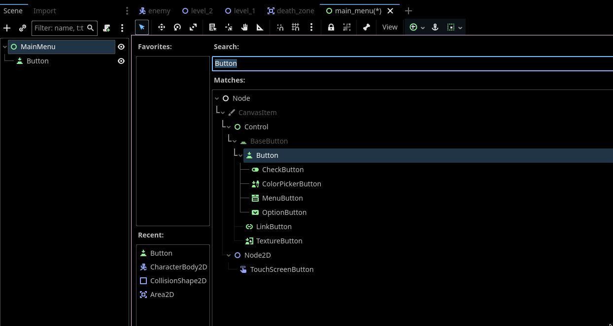
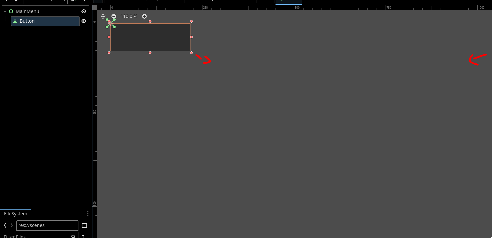
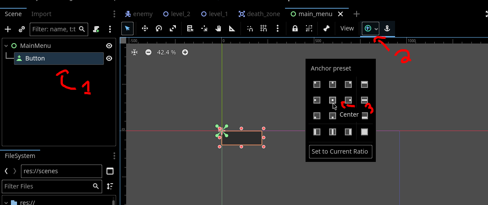
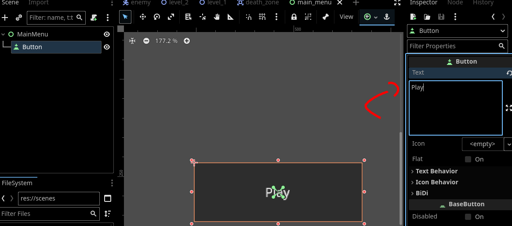
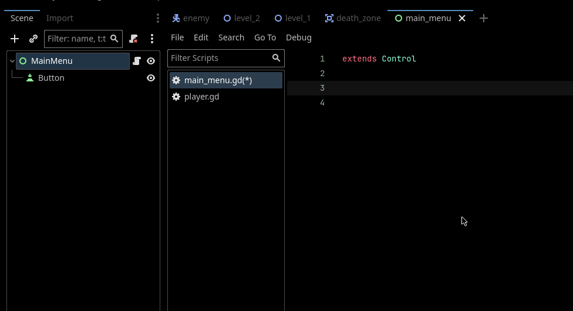
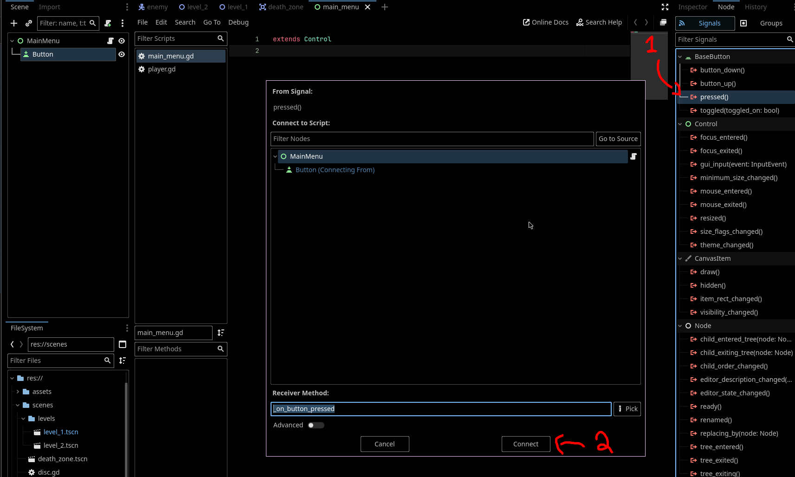
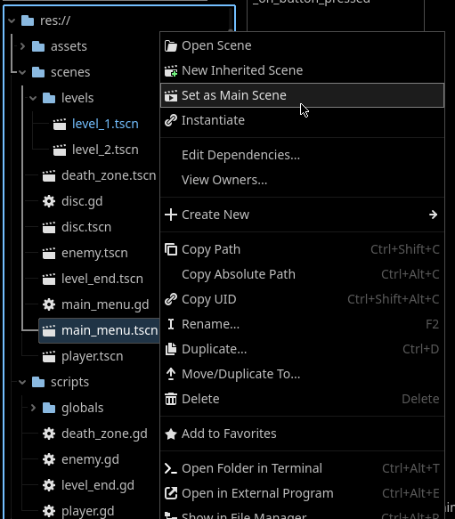

# Adding a Main Menu
In the last section, we added logic for traversing to the next level. Lets now give the player a nicer introduction with a **Main Menu**.

---

## Creating the Basic UI

Lets create a new scene for our starting menu. The UI will be very bare bones for now.


1) Create a new scene with the root node as `User Interface`

 

> Creating a `UI Interface` scene sets the root node as a `Control` node. All UI nodes in Godot inehrit from `Control`.

2) Name the root node `MainMenu` and save this scene where ever you see fit as `main_menu.tscn`



3) Add a new child node of type `Button` to your `MainMenu` root node.

 

4) Let's enlargen the button. The blue rectangle you see is the size of the players screen, called the viewport. Scale the button based on that.



> Remember way in the start of the tutorial when we had you set the viewport width and height in the settings? This blue rectangle is what you were resizing.

5) We should now center the button. We could drag it ourselves, but that would be imprecise. We will instead use the anchoring feature that comes with `Control` UI nodes. Select the `Button` node and Navigate to the top bar of the Scene Dock. Click on the anchor tab and select `Center` on the menu that pops up.

> `Control` nodes allow you to define an anchor position relative to the parent control node or the viewport as we do above. In our button, we set the anchor as relative to the center of the viewport, which is the blue rectangle.

 

6) We need some text on the button. Select the `Button` and navigate to its `Text` property. Set this to "Play" or whatever else you would like.

 

Cool! Our UI, while bare, is present. Lets actually start the game when the user presses the button.

## Adding the logic

Attach a new script to the `MainMenu` root node and save it wherever you see fit. 

 

We need to know when the player presses the "Play" button so we can start the game. The `Button` node gives us a handy `Pressed` signal that we will attach to our `MainMenu` script.

 

We implemented a function in our `LevelManager` that resets the scene to the current level, so we will just call that in our new signal handler. 

```gdscript
extends Control

func _on_button_pressed() -> void:
	LevelManager.restart_level()
```

## Setting the Main Scene

Now, set the main scene as our new main menu.

 

When you play the game, you should be put on our new main menu instead of immediately dropping us in the game. Yay!

---

We've added a functional main menu to our game. This is effectively the end of this extension. In the [next section](./final.md), you will develop your own UI!
