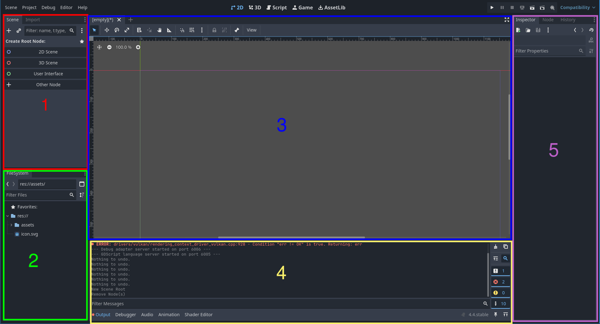
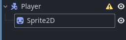
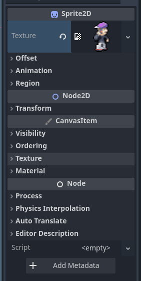
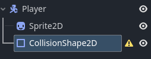
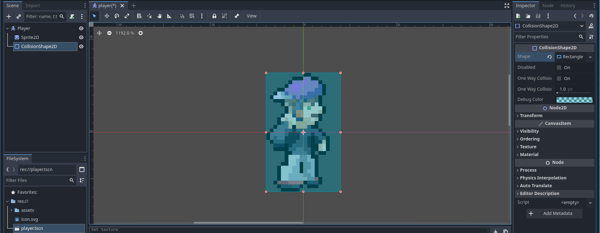
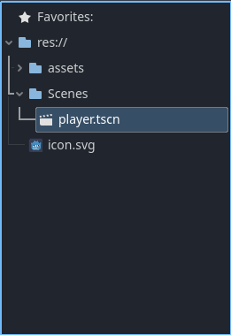
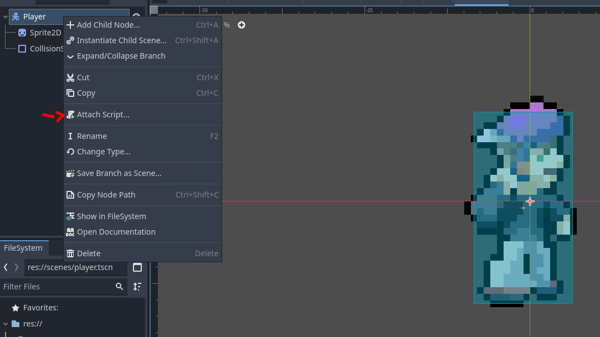
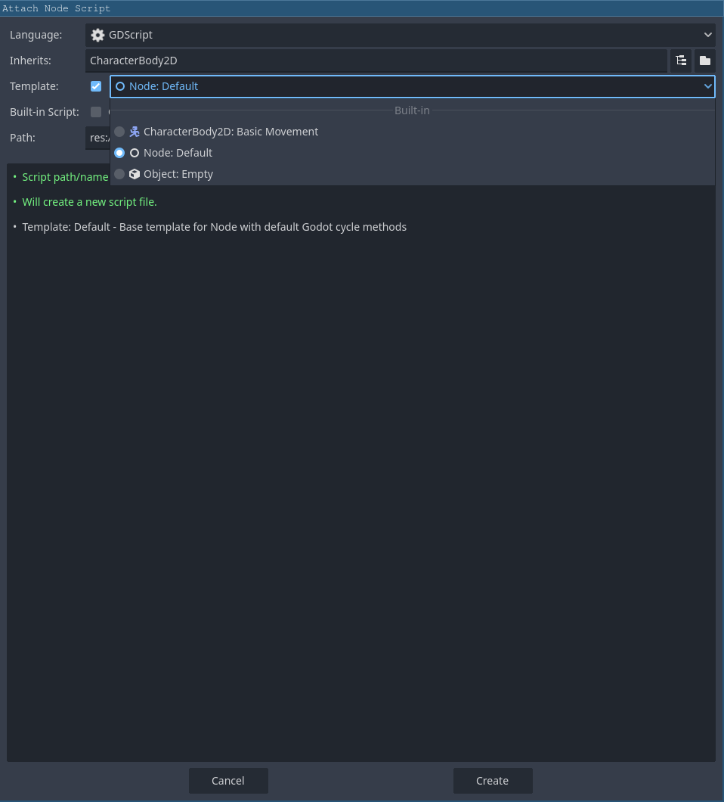

# Character movement

In this section, we will make a player scene with a hitbox and sprite. We will also add a movement script to our player.

---

### Before we get into the programming, lets review the parts of the Godot Editor



1) Scene Dock: Here you can manage the active scene's nodes
2) Filesystem: Your project's files and assets 
3) Workspace: Visually manage the scene, drag, resize, rotate
4) Output: See logging and debugging info 
5) Inspector: Edit properties of the selected object

Scenes are compartments that keep relevant nodes and scenes to that scene. For example, a scene called StageOne will will hold nodes for the first level, and a scene called Player will hold nodes player's hitboxes and animations. Scenes can encapsulate other scenes!
Nodes are the building blocks to your scenes, and thus, your game. They can fulfill everything you need: collision, animation, user-controlled bodies, UI, etc. Nodes can be attached to other nodes in a 'parent-child' hierarchy, creating a relationship known as a tree. The top-most node is known as the 'root node'.

## Player Setup
1) From the Scene Dock, create the new player scene by pressing `Other Node` and add a `CharacterBody2D` node to the current scenes
    - A `ChracterBody2D` node is used for implementing moving objects and, since this is the first node in this scene, it will automatically become the root node
2) Double click on this newly created node and rename it to player
    - Always rename your root nodes as soon as possible to keep everything neat!
3) Right click on the root player node and add a 'Sprite2D' node as a child.   
 
4) From the asset file in the Filesystem, drag `idle c.png` into the `Texture` field of the `Sprite2D` in the Inspector.  

5) Now, we need a hitbox for our player. Add a `CollisionShape2D` as a child of the player node.   

6) The `CollisionShape2D` still doesn't have a shape yet. In the inspector, select the shape field dropdown and select `New RectangleShape2D`. Then, resize the blue rectangle in the Scene Dock to fit the player sprite.  


Now, save these scenes as `player.tscn` by pressing `Control + S` or using the `Scene` tab from the top-leftmost bar. You should also create a scenes folder for better organization.  


You have made a basic player scene! See how you can add different nodes to a parent to achieve different purposes like hitboxes or sprites? This is called 'Composition' and is used commonly used in godot to build modular and reusable game objects. 

Excerpt from [gotut.net](https://www.gotut.net/composition-in-godot-4/): **Composition is a design principle that involves creating complex objects by combining simpler, reusable components. Using components has the following advantages:**

- Reusability: Components can be reused across different parts of the game.
- Modularity: Components are independent, allowing you to mix and match them as needed.
- Flexibility: Components can be easily replaced or extended without affecting the rest of the system.
- Consistency: Changes to a component automatically apply to all objects that use it, ensuring uniform behavior across your game.

---

## Character movement script
So far, we've been telling you exactly what to do and how to do it. Now though, you're going to have to do a little more thinking. We'll provide basic guidelines and simple examples for the next steps, but you will have to write some code yourself. 

### Variable and Function Setup
1) First, attach a script to the root `Player` node.  
 

> With scripts, you can add extra behavior to nodes.

2) Create the script with the `Node:Default` template as we would like you to write the movement script yourself.  


### Now, let's look at what we have so far... 
```gdscript
extends CharacterBody2D


# Called when the node enters the scene tree for the first time.
func _ready() -> void:
    pass # Replace with function body.


# Called every frame. 'delta' is the elapsed time since the previous frame.
func _process(delta: float) -> void:
	pass
```
- On the first line, you can see that it says `extends ChracterBody2D`. This is because it's attached to the player's root node, and is therefore modifying the behavior of the `CharacterBody2D` Node. Your player node will 'inherit' all the properties of the `CharacterBody2D`.
- The `_ready()` function is called one time as soon as the node is loaded in.
- The `_process(delta: float)` is called by the engine every time it draws a frame. The `delta` variable is the time from now and the last frame in seconds. Think of it as running constantly over and over again.

For this script, you can delete the `_process(delta: float)` function and replace it with `_physics_process(delta: float)`. This is a special Godot function that is called whenever the physics engine is updated. It's called at a fixed frequency, 60 times a second by default. It's independent of the games actual framerate, so that the physics calculations runs smooth even if the actual graphics are lagging behind. Since it's called at a fixed frequency, the `delta` (time since last call) will generally be constant. This is where the movement logic will be written.

> You can read more about physics processing [here](https://docs.godotengine.org/en/stable/tutorials/scripting/idle_and_physics_processing.html#doc-idle-and-physics-processing) in the Godot docs.

### Implementing movement 
For now, we will only implement left and right movement. First, we will have to declare some variables:
- `SPEED: int`: This will be how many pixels a second our character will move at. This will be a constant variable. As a convention, constant variables are commonly typed out in all caps to clearly show that they are constant.
- `x_direction: int`:  This variable will be -1 if we are moving left, 1 if we are moving right, and 0 if we are stood still.

In Godot, variables are declared like this:
```gdscript
[const | var] my_variable: <datatype> = <data>

Ex:
var number: int = 5
const constant: int = 10
```

We will be updating the `x_direction` variable when the player presses the left or right arrow keys. In Godot, you check for key presses with the `Input` singleton. You can call it like this:
```gdscript
if Input.is_action_pressed("ui_left"): # Returns true if pressing left arrow key
    # Set movement to left
elif Input.is_action_pressed("ui_right"): # You can probably guess what this does
    # Set movement to right
else:
    # Stop movement
```
> A singleton (`Input` in the above example) is just a global class that you can call from anywhere and there exists only one instance of. Think of it as a static or global class.

The `CharacterBody2D` node also provides us with useful functionality to manage movement:  
*You can access all these variables and methods anywhere in the script as the script extends the `CharacterBody2D` node*
- `velocity: Vector2D`: This variable holds the current velocity of the player.
    - This node has 2 properties, x and y, representing the horizontal and vertical velocities respectively. You can access them with `velocity.x` or `velocity.y`.
- `move_and_slide()`: This function moves the `CharacterBody2D` based on `velocity`. Godot will automatically detect collisions and calculate movement for you! It should be used after you update the velocity. 
- `is_on_floor() -> bool`: This function will return true if the player is on the floor. This will be useful later when we implement jumping.

### Now, it's your turn!
We will give you the outline but you will need to fill in the rest. We'll give you the answer a bit further down, but try filling it out first!
```gdscript
extends CharacterBody2D

### Declare a constant speed, how many pixels a second our player will move
### Declare a variable x direction

# Called when the node enters the scene tree for the first time.
func _ready() -> void:
	pass


func _physics_process(delta: float) -> void:
    ### Handle arrow key input

    ### Update velocity based on input
	
    ### Tell godot to calcluate movement (move_and_slide)
```

Now, here is roughly what your code should look like:
```gdscript
extends CharacterBody2D

const SPEED: int = 200 # You can play around with this value!

var x_direction: int = 0

# Called when the node enters the scene tree for the first time.
func _ready() -> void:
	pass # Replace with function body.

func _physics_process(delta: float) -> void:
	
    if Input.is_action_pressed("ui_left"):
        x_direction = -1
    elif Input.is_action_pressed("ui_right"):
        x_direction = 1
    else:
        x_direction = 0
    
    velocity.x = x_direction * SPEED

    move_and_slide()

```
> If your script looks different but achieves the same thing, then that's fine!

### Adding gravity

But there is a problem, our script doesn't account for gravity! We don't want our character to just float in the air, so you can add this snippet to the start of `_physics_process()`.

```gdscript
if not is_on_floor():
    velocity += get_gravity() * delta
```

> You can look [here](https://dev.to/godot/gdscript-cheatsheet-5ghe) if you want a deeper dive into the syntax of GDScript, the programming language used in Godot. GDScript is very similar to python.

---

Now, you have a complete movement script. However, there is no ground for our character to stand on! In the [next section](./section-2.md) we will build an environment for our character to move around in.
