# Building a world

In this section, we are going to build the actual stage the player will stand on. We are gonna do this with the help of a **tileset**.

---

## Setting up the scene tree

1) Right click on your `scenes` folder, create a new scene, then save it under `world.tscn`.   
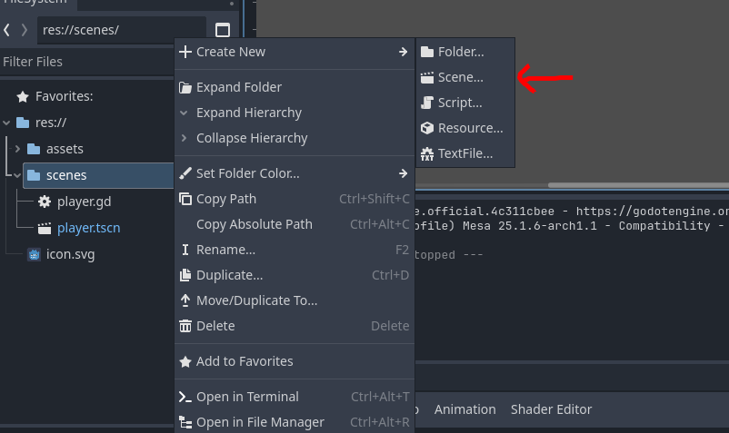   
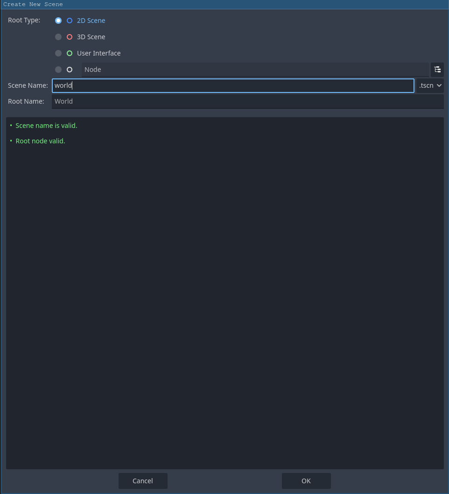   

2) Drag the player scene into this scene's Workspace.    
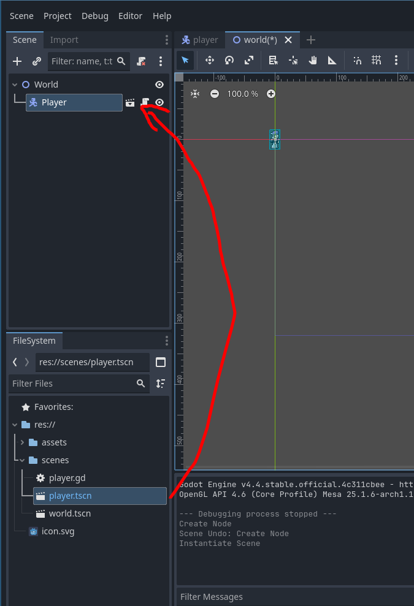

3) Now, we are going to start making the actual level. Right click on the world node on the inspector and add a new `TileMapLayer` node. Also, add a `Camera2D` node as a child of the player. The camera is a child of the player because we want it to move as the player moves. Child nodes always follow their parents. Your scene tree shold look like this:   
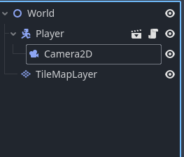

## Making the tilemap

Now we are going to import our **tileset** that we will use to create the levels of our platformer. A tileset is a collection of small, reusable images called tiles arranged in a grid. This is used in game development to create unique levels easily out of reusable assets. You are probably going to be using them frequently.

1) Select the `TileMapLayer` in the scene tree and create a new tileset in the inspector.    
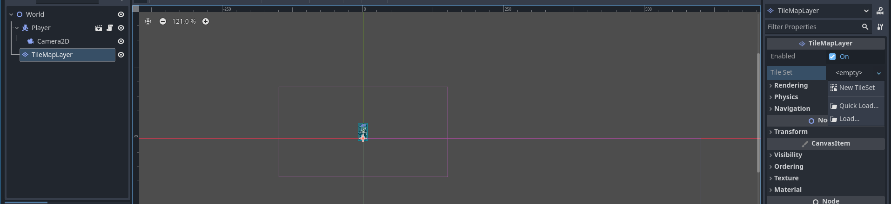 

2) Go to the `TileSet` page on the bottom toolbar and drag in the `tilemap.png` file from the filesystem in the `assets` folder. If it asks you "Would you like to automatically create tiles in the atlas?", select "Yes".    
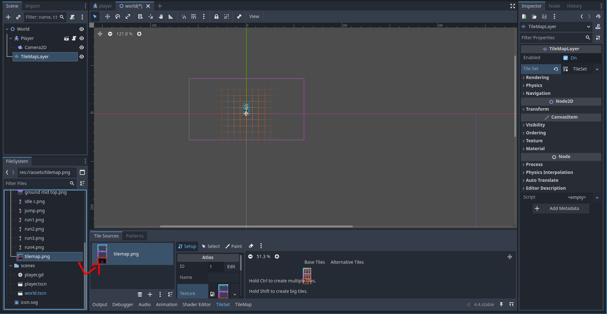 

3) If you start putting in tiles in the stage right now, our player would fall right through! We need to make a new physics layer on the `TileMapLayer` node so the player has something to stand on. Select our `TileMapLayer` node in the scene tree, then, under physics layers, press "Add Element".   
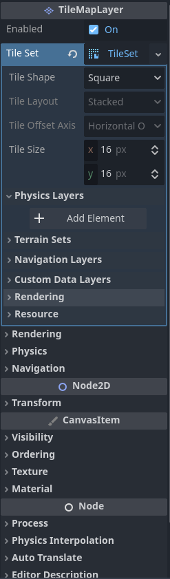 

4) Now, go back to the `TileSet` section on the bottom tool bar. Select the paint page and with the "Select a property editor" dropdown, select "Physics Layer 0". We will need to add the physics layer to each of our tiles.   
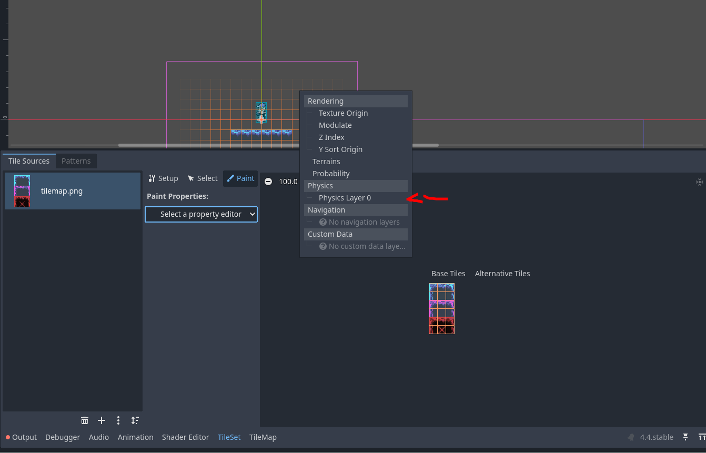

5) Paint the property on all of our tiles. This will allow the player to collide with them.   
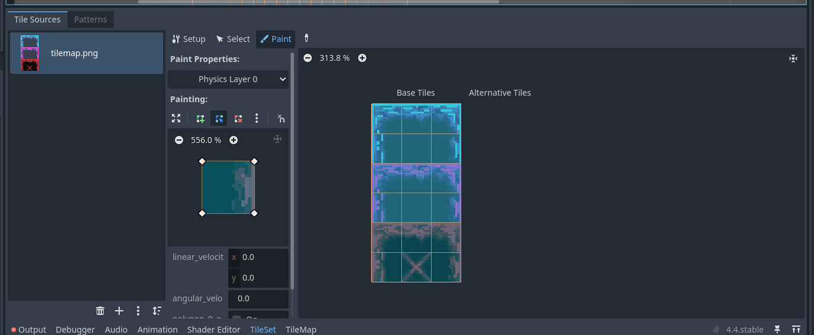

Now we have imported our tileset and can start creating the actual stage for our platformer.

## Creating stage

With tilesets, you can make environments with a consistent visual style, without having to draw assets for each seperate part of a game! You can take some artistic freedom here with your level design.

You can select the different tiles and paint them in the workspace. There is a rectangle tool and erase tool at the top of the bottom dock as well. Go ahead and make an interesting and fun level!
 

## Testing the game

If you did everything right, now you should have a playable game! First though we have to select the scene godot should start the game from. Right click on `world.tscn` on the filesystem and press "Set as Main Scene".    
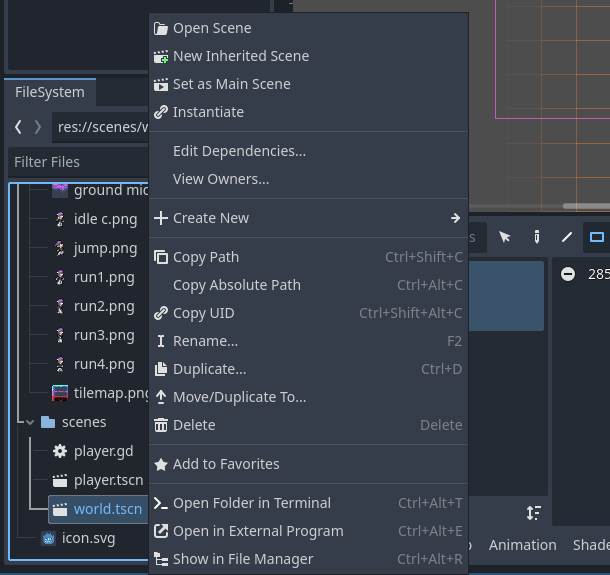

Now we can test out the game by pressing the play icon on the top right of the screen. This should open a new window in which you can test and debug the game. When you press the left and right arrow keys, the player should be able to move. You should also be able to fall off the edge. 

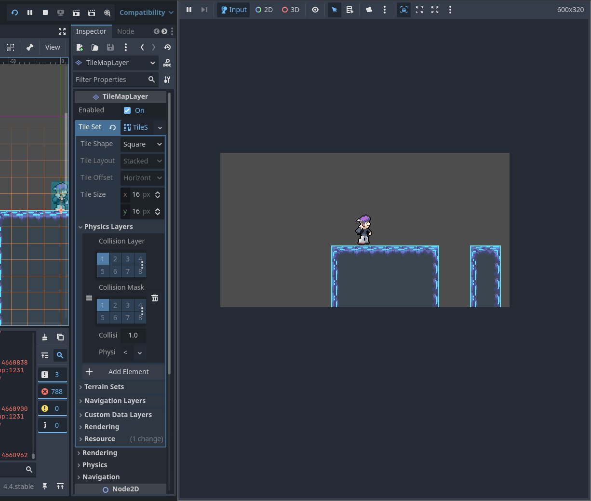 

This game is kind of boring though, as our player can't jump at all, defeating the whole point of a platformer. Lets fix that in the next section.

---

You can now move on to the next section [here](./section-3.md).
