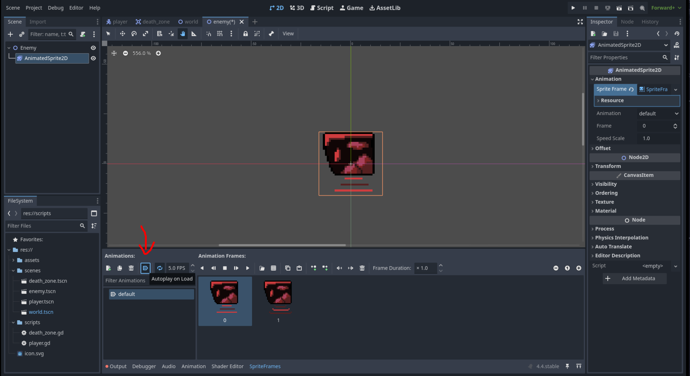
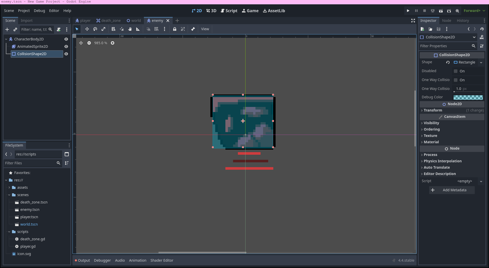
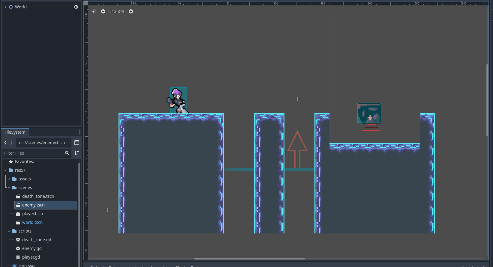

# Adding enemies

In this section, we will create an enemy for our player to get past. This enemy will move until it encounters a wall, then turn around and repeat. When the player touches this enemy, they will die and the level will restart.

## Creating the enemy scene

1) Create a new scene with the root node of `CharacterBody2D` and save it as `enemy.tscn` in your scenes folder. This is a `CharacterBody2D` because it will behave similarly to the player.

2) Add a `AnimatedSprite2D` as a child of the `CharacterBody2D`. Make a new animation for the enemy called "default" and add `enemy1.png` and `enemy2.png` as the frames. After you added the frames, set is to "Autoplay on Load" so that the animation instantly plays when the scene loads.

 

2) Add a `CollisionShape2D` as a child of the root `CharacterBody2D` node and set the shape as a rectangle. Resize this in the scene dock to fit the sprite of the enemy.



3) Attach a script to the enemy with the default template. Save it as `enemy.gd` in your scripts folder.

4) Now, save your enemy scene and go back to `world.tscn`. Place your newly created enemy somewhere where it's between two walls.



The enemy is almost done, but it doesn't move yet. If you play right now, you would be able to stand on the enemy. Now, we will make a movement script for the enemy. Open up your newly created `enemy.gd`.

## Scripting the enemy

With your experience scripting the player earlier, you should be able to program this enemy alone now. Here is what your script should do:
- Move the enemy horizontally in any direction until it encounters a wall.
    - Use the bulit in `CharacterBody2D` function `is_on_wall()` to check for this.
- When it encounters a wall, it should turn around.

Remember to use a constant for it's speed, it's bad practice to throw called magic numbers in your code without any explanation. Remeber also that since it's a physics process, you should be using `physics_process` instead of the default `process`.

We encourage you to try to script this one yourself! If it doesn't work at first, go ahead and try debugging it.

This is how your script should look something like:
```gdscript
extends CharacterBody2D

const SPEED: int = 50
var x_direction = 1

func _physics_process(delta: float) -> void:
	if is_on_wall():
		x_direction *= -1
	
	velocity.x = SPEED * x_direction
	move_and_slide()

```

Now if you play, the enemy will hit a wall, then turn around when it has. But it bounces of the player too! Lets fix that by adding logic to kill the player on the enemy. Here is what we need to add to the script:
- Before the movement logic, we need to check if anything hsa collided with the enemy in the loop.
- If they have, we need to check if that collider is in the group "Player".
- If they are, call the `die()` function on them.

We can do this with these `CharacterBody2D` functions:
- `get_slide_collision_count()`: Returns the amount of collisions during the last call of `move_and_slide()`. 
- `get_slide_collision(int)`: Returns a `KinematicCollision2D` identified by the index you passed in, which contains all the information about the collision including the actual object that collided. You can access the actual collided node with `get_slide_collision(x).get_collider()`. 
    - You can iterate over the number given by `get_slide_collision_count()` with a for loop, then pass the index into `get_slide_collision(i)` to get the collision like this:
    ```gdscript
    for i in get_slide_collision_count():
        get_slide_collision(i).get_collider() # Returns node we collided with
    ```
    > Read more about iterating and looping [here](https://gdscript.com/tutorials/looping/).

Try programming it and debugging yourself!

Here is what your script should look something like now:
```gdscript
extends CharacterBody2D

const SPEED: int = 50
var x_direction = 1

func _physics_process(delta: float) -> void:
	for i in get_slide_collision_count():
		var collider = get_slide_collision(i).get_collider()
		if collider.is_in_group("Player"):
			collider.die()
	
	if is_on_wall():
		x_direction *= -1
	
	velocity.x = SPEED * x_direction
	move_and_slide()
```
---

Now we have a moving enemy for our player to get past that actually kills them! But the player has no way to defend themselves, so lets give them an option in the [next section](./section-7.md).
