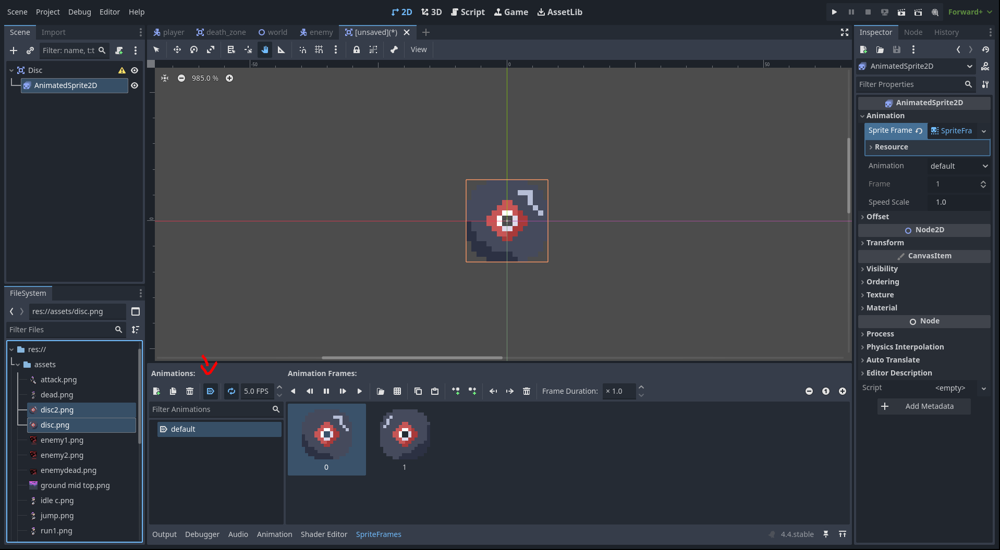
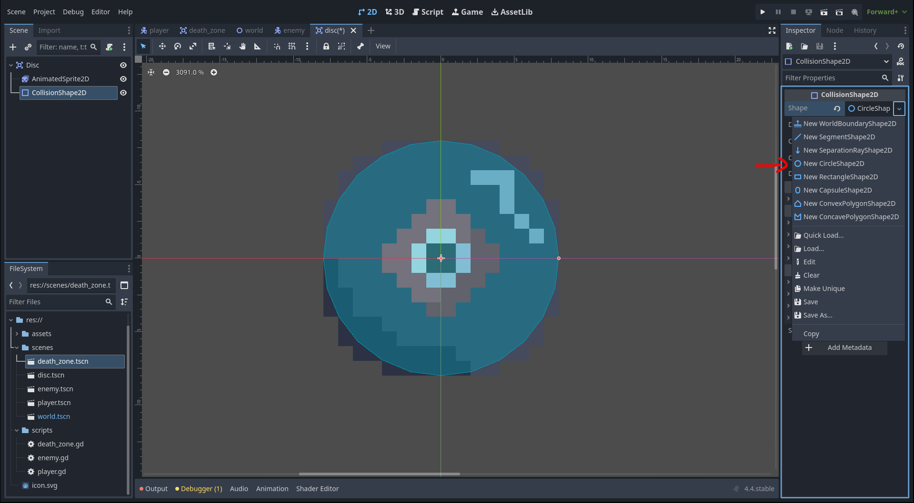
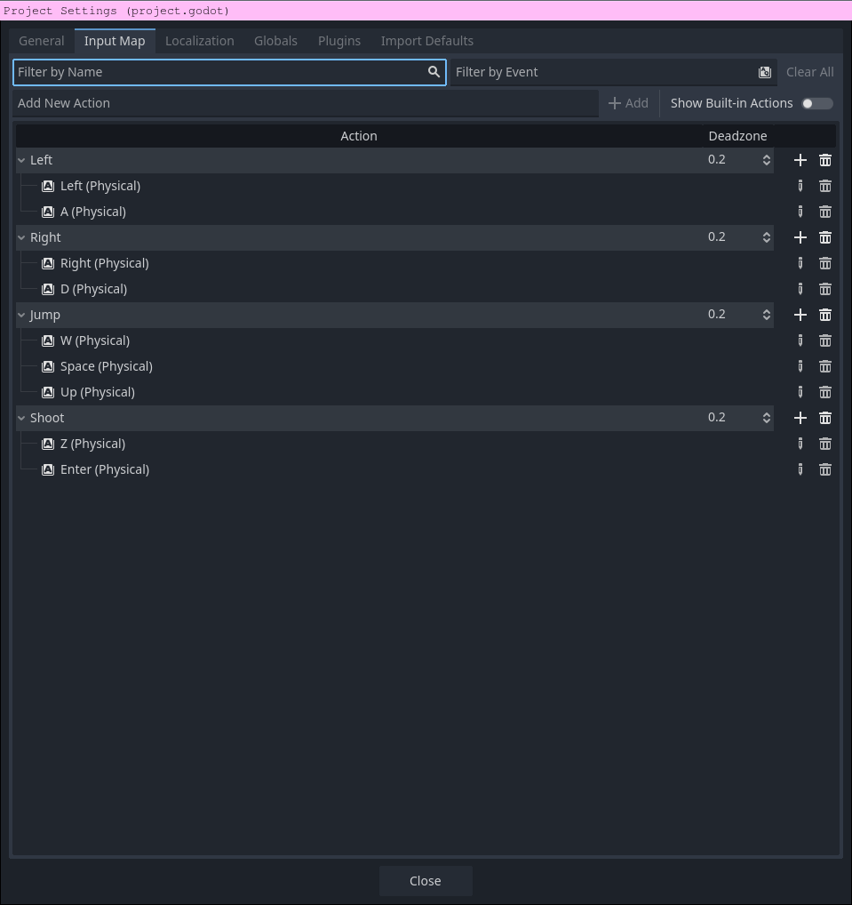
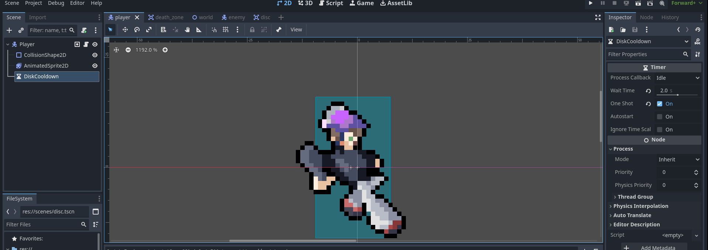
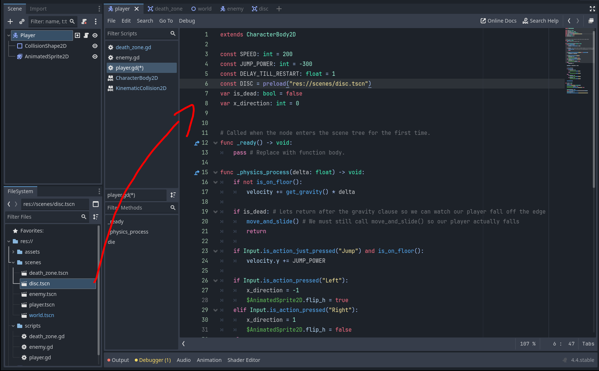
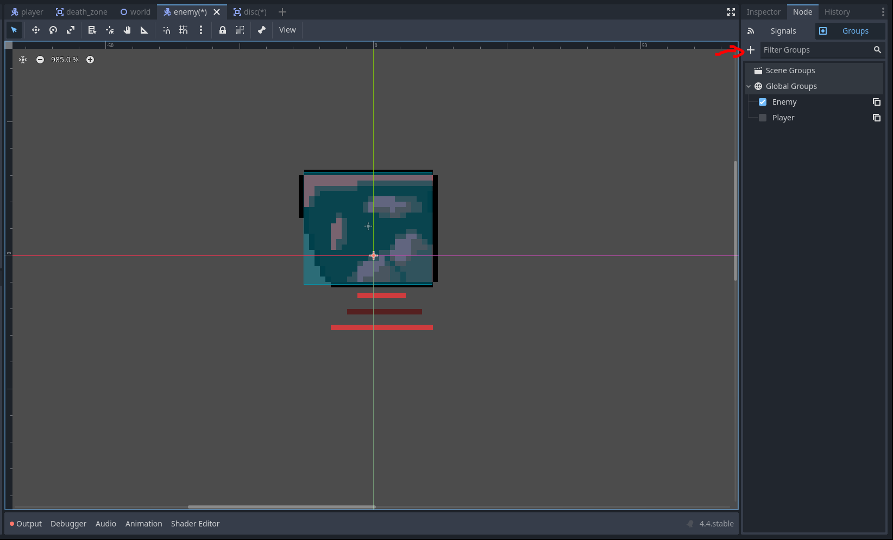
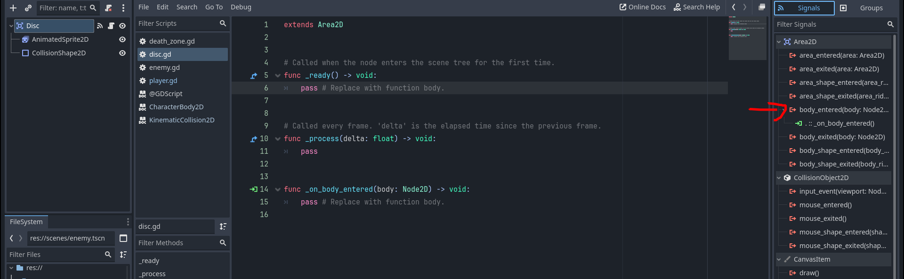
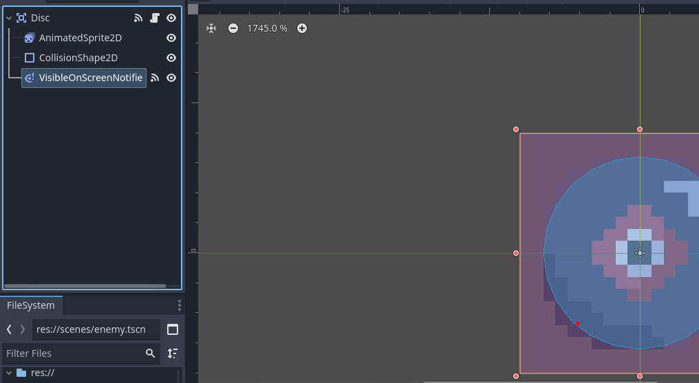
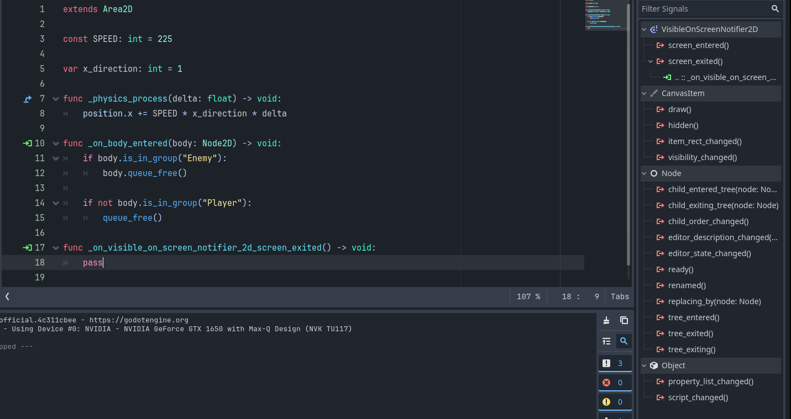

# Attacking with Discs

In this section, we are going to give our players a throwable disc that they can use to kill enemies. 

## Making the Disc Scene

1) Create a new scene with the root node as an `Area2D`. Rename the root node to "Disc" and save the scene in your scenes folder as `disc.tscn`. 

2) Add an `AnimatedSprite2D` and make an animation called "default" with the frames as "disc.png" and "disc2.png". Set this animation to "Autoplay on Load".

 

3) Add a `CollisionShape2D` to the disc and add a `CircleShape2D` shape on it. Resize it to fit the disc's sprite.



Lets save the programming of the disc for later so we can more easily debug the script. Lets instead program spawning the actual disc first.

## Adding input

Before we get to the programming, we need to get to add an input that actually allows the player to shoot. On the top left bar, go to "Project" then "Project Settings". Then go into the "Input Map" tab and add a new "Shoot" action. Add whatever keybinds events you want to correspond to shoot. I will use `Enter` and `z`.

 

## Adding a cooldown timer

We don't want the player to spam the disc endlessly, so we are going to give them a small cooldown between throws. Head back to your player scene and add a `Timer` node. Rename this timer to `DiscCooldown`. Now, head to the inspector with the `DiscCooldown` node selected and set the "Wait Time" to something reasonable, like 1 second (you can try out different values until it feels right). This will be the cooldown after each disc throw. Also, set the "One Shot" property to be true so that the cooldown doesn't infinitely repeat.

 

Now, everytime the player throws a disc, we will start the timer. Then, if the player tries to throw a disc, we will check to see if the timer is ongoing or has ended. If it's ongoing, we will ignore it. If it has ended, we will restart the timer and throw a disc.

Here is how you can utilize the node in your player script:
- `$DiscCooldown.start()`: Start the timer.
- `$DiscCooldown.is_stopped()`: Returns true if the timer is stopped and false if it's ongoing.

## Programming the player, again

Now, go back to your `player.gd` script and drag the `disc.tscn` scene into your script while holding `Ctrl` or `⌘`. If this doesn't work for you, you can just go ahead and type out the output.



> We have to load scenes before we can put them in a scene programatically, unlike when we place them in a scene preemptively. We use `preload()` because the path is known during compile time. You would use `load()` if it's not (or if you want to have the game load it at a different time as preload will load on game startup).

The functions `preload(path)` and `load(path)` will load the scene from the filesystem and return a resource corresponding to that scene. You can call `.instantiate(path)` on the resource to get an instance of the scene. The scene won't instantly appear as you still need to add it to the scene tree. You can add it to the scene by calling `add_child(node)` on another node currently on the scene. If you want to add it to the current scene, you can call `get_tree().current_scene.add_child(node)`.

So, you should call `DISC.instantiate()` and then add it to the current scene.

> Anything that is saved and loaded from the filesystem is a resource. You can read more about resources and loading [here](https://docs.godotengine.org/en/stable/tutorials/scripting/resources.html) in the Godot docs. **Nodes** give you functionality, and **Resources** are just data containers.

Now we should be ready to start programming the player's ability to spawn discs! Try programming it yourself. Here's what you should add to your existing `player.gd`:
- If the player presses the "Shoot" action:
    - Instantiate the disc
    - Set the disc's `.position` property to the player's position.
    - Add the disc to the scene tree
    - Restart the timer

Try debugging it yourself if you run into a problem, just run the scene and you should be able to spawn an unmoving disc on top of the player every some number of seconds after you press the "Shoot" action.

> This if clause should go after your early return if the player is dead, so they can shoot in the afterlife.

Here's an example for how your script could look:
```gdscript
extends CharacterBody2D

const DISC = preload("res://scenes/disc.tscn")

const SPEED: int = 200 
const JUMP_POWER: int = -300
const DELAY_TILL_RESTART: float = 1

var is_dead: bool = false
var x_direction: int = 0


# Called when the node enters the scene tree for the first time.
func _ready() -> void:
    pass # Replace with function body.

func _physics_process(delta: float) -> void:
    if not is_on_floor():
        velocity += get_gravity() * delta

    if is_dead:
        move_and_slide()
        return

    if Input.is_action_pressed("Shoot") and $DiscCooldown.is_stopped(): # Check if player cooldown is over
        $DiscCooldown.start() # Restart it
        var new_disc: Area2D = DISC.instantiate() # Instanciate new disc scene
        new_disc.position = position # Set the position to the player's
        get_tree().current_scene.add_child(new_disc) # Add it to the scene

    if Input.is_action_just_pressed("Jump") and is_on_floor():
        velocity.y += JUMP_POWER

    if Input.is_action_pressed("Left"):
        x_direction = -1
        $AnimatedSprite2D.flip_h = true
    elif Input.is_action_pressed("Right"):
        x_direction = 1
        $AnimatedSprite2D.flip_h = false
    else:
        x_direction = 0

    velocity.x = x_direction * SPEED

    if is_on_floor():
        if x_direction != 0:
            $AnimatedSprite2D.play("run")
        else:
            $AnimatedSprite2D.play("idle")
    else:
        if velocity.y > 0:
            $AnimatedSprite2D.play("fall")
        if velocity.y < 0:
            $AnimatedSprite2D.play("jump")

    move_and_slide()

func die() -> void:
    is_dead = true
    set_deferred("velocity", Vector2.ZERO)
    $AnimatedSprite2D.flip_v = true
    $CollisionShape2D.set_deferred("disabled", true)
    
    Engine.time_scale = 0.5
    await get_tree().create_timer(DELAY_TILL_RESTART).timeout
    Engine.time_scale = 1
    get_tree().change_scene_to_file("res://scenes/world.tscn")
```

Let's start actually programming the disc movement in the next part.

## Adding enemy group

Before we actually get to programming however, we will need to have a way to check whether or not something the disc hits is actually an enemy. Go back to your enemy scene and make a new global group called "Enemy". Add the enemy scene to this group.

 

## Programming the disc

Now that we have a way of detecting what is an enemy, go back to your disc scene and attach a script to the root node. Here is what this script is going to be doing:
- Move a certain amount of pixels each frame in a variable horizontal direction
    - Make a constant speed variable
    - Make an x direction variable
    - Add this speed multiplied by the `delta` parameter in `_physics_process` to `position.x` each frame 
        - `delta` is the time since the last call to `_physics_process`, and `_physics_process` is generally called 60 times a second. So, if we want the disc to move at, for example, 100 pixels a second, we would multiply this speed by `delta`. If you didn't, it would go 300 pixels 60 times a second.
- Use a signal to detect when another body enters the disc's collision area (use the `body_entered` signal)
    - If the body is in the group of enemy, call `body.queue_free()` to delete it. (we will later make an enemy death animation)
    - After, call `queue_free()` to destroy the disc itself.
        - Don't do this if the body the disc hit is the player though, since the disc starts at the players position. Remember how to check if the body is the player?

Your movement logic should be in `_physics_process`. Also, you need to attach the `body_entered` signal to your script:



Now, armed with that knowledge, you can go ahead and try programming the disc yourself!

Here is something similar to how your script should look:
```gdscript
extends Area2D

const SPEED: int = 225

var x_direction: int = 1

func _physics_process(delta: float) -> void:
    position.x += SPEED * x_direction * delta

func _on_body_entered(body: Node2D) -> void:
    if body.is_in_group("Enemy"):
        body.queue_free() # Destroy the enemy

    if not body.is_in_group("Player"):
        queue_free() # Destroy the disc if the body isn't the player
```

There is a problem though, the problem being that the disc only goes right! Let's go back to our player script and modify how the disc is spawned in. We will modify the `x_direction` of the disc depending on what way the player's sprite is facing before adding it to the tree:

```gdscript
    if Input.is_action_pressed("Shoot") and $DiscCooldown.is_stopped():
        $DiscCooldown.start()
        var new_disc: Area2D = DISC.instantiate()
        new_disc.position = position
        
        if $AnimatedSprite2D.flip_h == true: # Check what way the player is facing
            new_disc.x_direction = -1
        else:
            new_disc.x_direction = 1
        
        get_tree().current_scene.add_child(new_disc) 
```

Now you have a fully functional throwable weapon for the player to use! There is still one small problem, however.

## Destroying the disc when it's out of sight

Right now, your disc moves until it hits something. But what if it goes off the map into the infinite void around our map? We don't want an endless pileup of useless discs off screen, so lets make it so the disc self destructs when it's off the player's screen. 

1) Go to the disc scene and add a `VisibleOnScreenNotifier2D` as a child of the root node.



2) Go to the `VisibleOnScreenNotifier2D`'s signals in the `Node` page of the inspector and attach the `screen_exited` signal to the script.

 

3) When this signal is emitted, simply call `queue_free` to destroy the disc when its out of the scene.
```gdscript
func _on_visible_on_screen_notifier_2d_screen_exited() -> void:
    queue_free()
```

---

With that, you are basically done with this tutorial! We have a functioning 2D platformer game with enemies and ways for the player to defend themselves. [Here](./final.md) is the next section where you create your OWN mechanic!

